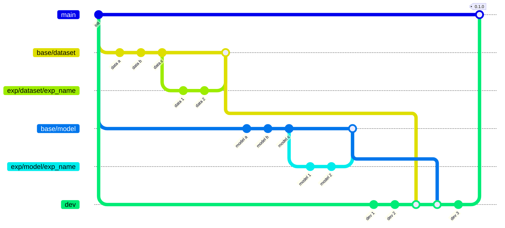

# End-to-end pipeline for training RL

Contains an end-to-end pipeline for training a RL algorithm in a bipedal environment

### Dependencies

- python: `^3.11`
- Linux

### Install Dependencies

1. Our highly recomendation to use `conda`
    - Install `conda`. Use [following instruction](https://www.anaconda.com/docs/getting-started/miniconda/install)
    - Create environment `conda create -n rl-trainer-env python=3.11`
    - Activate environment `conda activate rl-trainer-env`
    - We highly recommend to use bind `conda` + `poetry`, so let's set up poetry in a conda environment.
        ```
        conda env list # Check path to the environment, e.g. ~/miniconda3/envs
        export CONDA_ENV_PATH=<your path>
        poetry config virtualenvs.path $CONDA_ENV_PATH
        poetry config virtualenvs.create false
        ```
        ```
        pip install poetry
        ```
    - Check the path of the poetry installation: `which poetry`. It should be installed in your created conda environment

2. Install all dependencies
    `poetry install`
3. Activate pre-commit
    `pre-commit install`


## Git Flow


