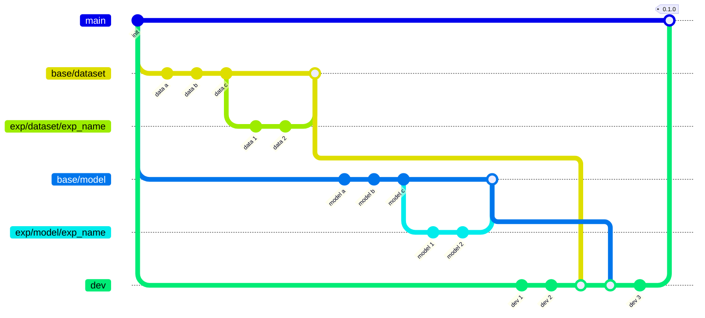

# End-to-end pipeline for training RL

Contains an end-to-end pipeline for training a RL algorithm in a bipedal environment

### Dependencies

- python: `^3.11`
- Linux

### Install Dependencies

1. Our highly recomendation to use `conda`
    - Install `conda`. Use [following instruction](https://www.anaconda.com/docs/getting-started/miniconda/install)
    - Create environment `conda create -n rl-trainer-env python=3.11`
    - Activate environment `conda activate rl-trainer-env`
    - We highly recommend to use bind `conda` + `poetry`, so let's set up poetry in a conda environment.
        ```
        conda env list # Check path to the environment, e.g. ~/miniconda3/envs
        export CONDA_ENV_PATH=<your path>
        poetry config virtualenvs.path $CONDA_ENV_PATH
        poetry config virtualenvs.create false
        ```
        ```
        pip install poetry
        ```
    - Check the path of the poetry installation: `which poetry`. It should be installed in your created conda environment

2. Install all dependencies
    `poetry install`
3. Activate pre-commit
    `pre-commit install`

### Run training

1. First run MLFlow server
    ```
    mlflow server --host 127.0.0.1 --port 8080
    ```
2. Run training
    ```
    python src/rl_trainer/train.py
    ```


### Project structure

```yaml
./src
└── rl_trainer
    ├── algorithms                                  # <-- Add your models here
    │   └── ppo
    │       ├── config.py                           # <-- Model's config
    │       └── model.py                            # <-- Model
    |
    ├── base                                        # <-- Folder contains all base scipts
    │   ├── conf
    │   │   ├── model_stable_baselines_config.py    # <-- Base config for Stable Baselines models
    │   │   └── model_config.py                     # <-- Base config
    │   ├── model
    │   │   ├── base_stable_baselines_model.py      # <-- Base model for Stable Baselines models
    │   │   └── base_model.py                       # <-- Base Model
    │   ├── loader.py
    │   ├── mflow_setup.py
    │   └── registry.py
    |
    ├── callbacks                                   # <-- Keep all your callbacks here
    │   └── mlflow.py
    |
    ├── reporters                                   # <-- Keep all your reporters here
    │   └── mlflow_reporters.py
    |
    ├── configs                                     # <-- Define configs for you models here
    │   ├── algorithms
    │   │   └── ppo.yaml
    │   ├── environments
    │   |   └── bipedal.yaml
    │   └── common.yaml
    |
    |
    └── train.py                                     # <-- Main training script
```


### Set up experiment

You can easily set up different experiments just by changing the `common.yaml` config. Provide the environment and model you want to train or test here

```yaml
setup:
  env:
    name: BipedalWalker-v3 # <-- name is used only for mlflow tags
    config: src/rl_trainer/configs/environments/ bipedal_walker.yaml # <-- path to the environment config
  algo:
    name: ppo_baseline  # <-- name is used for mlflow tags
    config: src/rl_trainer/configs/algorithms/ppo.yaml  # <-- path to the model config
  seed: 42

mlflow:
  tracking_uri:  http://xxxx:yyyy # <-- Add here address and port
  ...
```


### Add your model

To add a new model, you need to define **two classes**:

---

1. `Model Config` - inherits from [ModelConfig](src/rl_trainer/base/conf/model_conf.py#L14-L73)

    - Implement the `create` function that uses the `_create` function from the parent class. This function is used for defining the model (propagates `input parameters` and `env` if applicable). For more information, please read the documentation (docstring) for the given [create method](src/rl_trainer/base/conf/model_conf.py#L61)

---

2. `Model` - inherits from [BaseModel](src/rl_trainer/base/model/base_model.py)

    You need to implement the default API with the following methods:

    - `learn`
        - Main method for the learning process
    - `save`
        - Save the model
    - `load`
        - Load the model

---

3. Add `Training Model Config` to the `src/rl_trainer/configs/algorithms` folder

---

### Model Config

Define a config class that will be used for creating the model instance. Each config should implement a `create` method.

>  `NOTE`: Your config should contain a `name` attribute. The pipeline will match the provided class and config by this attribute. In general, we match config and model by the `key` name.

>  `NOTE`: Remember to `register` your config using the `register_config` decorator. This will register the config and allow you to match the config with the model class.

You can check the example class below or the full code [PPOBaseline](src/rl_trainer/algorithms/ppo/config.py)

```python

@register_config
class PPOBaseline(StableBaselinesAdapterConfig):

    name: str = Field("PPOBaseline", alias="$name")

    def create(self, env: gym.Env) -> Model:

        model = self._create(env)

        if self.logger:
            loggers = self._setup_logger()
            logging.info("Setting up %d loggers for the model", len(loggers))
            for logger in loggers:
                model.set_logger(logger)

        if self.callbacks:
            callbacks = self._setup_callbacks()
            logging.info(
                "Setting up %d callbacks for the model", len(callbacks)
            )
            for callback in callbacks:
                model.set_callbacks(callback)

        return model

```

### Model


```
         Algorithm
            ↓
        Model Wrapper
            ↓
    StableBaselinesModels
```


### Training Model Config

Each model config should contain two things:

* `cls` – path to the module in the format `path:class`
* `$name` – **unique name** for the given model. This name is used to automatically match the config with the provided model.

If your model requires additional parameters, like in this case `inputs`, `logger`, or `callbacks`, you can define them here as well. Remember to add a method into the class to process the given parameters.

Here is the example of config:

```yaml
cls: rl_trainer.algorithms.ppo.model:PPOBaseline

$name: PPOBaseline

inputs:
    policy: MlpPolicy
    seed: 0
    learning_rate: 0.0003
    gamma:         0.99
    gae_lambda:    0.95
    clip_range:    0.2
    n_steps:       1024
    batch_size:    32
    n_epochs:      1
    ent_coef:      0.0
    vf_coef:       0.5
    max_grad_norm: 0.5
    progress_bar: True

logger:
    - stable_baselines3.common.logger:Logger:
        folder: null
        output_formats:
            - rl_trainer.reporters.mlflow_reporters:MLflowOutputFormat

callbacks:
    - rl_trainer.callbacks.mlflow:MLflowCallback:
        save_freq: 5000
```


### MLFlow

To track all experiments, we are wrapping the training pipeline with MLflow. This allows us to track all metrics, model parameters, and artifacts


### Model creation strategy


## Git Flow


