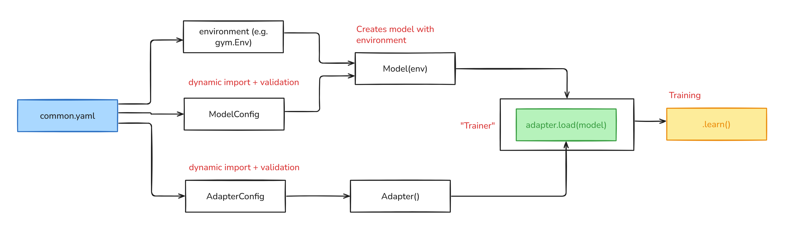
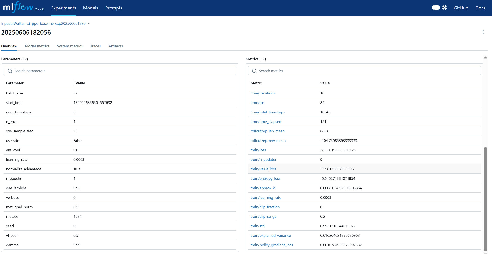
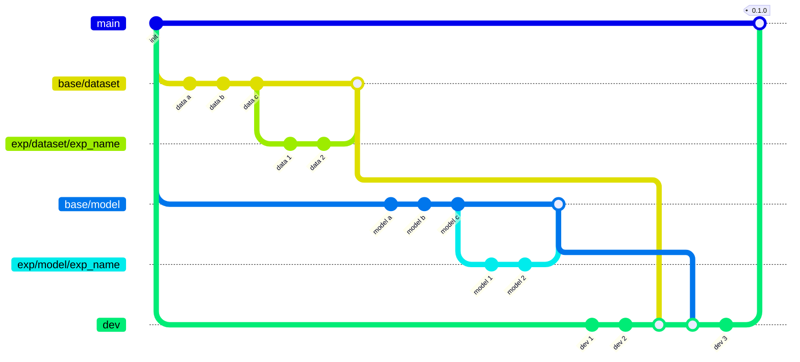

# End-to-end pipeline for training RL

Contains an end-to-end pipeline for training a RL algorithm in a bipedal environment

### Dependencies

- python: `^3.11`
- Linux

### Install Dependencies

1. Our highly recomendation to use `conda`
    - Install `conda`. Use [following instruction](https://www.anaconda.com/docs/getting-started/miniconda/install)
    - Create environment `conda create -n rl-trainer-env python=3.11`
    - Activate environment `conda activate rl-trainer-env`
    - We highly recommend to use bind `conda` + `poetry`, so let's set up poetry in a conda environment.
        ```
        conda env list # Check path to the environment, e.g. ~/miniconda3/envs
        export CONDA_ENV_PATH=<your path>
        poetry config virtualenvs.path $CONDA_ENV_PATH
        poetry config virtualenvs.create false
        ```
        ```
        pip install poetry
        ```
    - Check the path of the poetry installation: `which poetry`. It should be installed in your created conda environment

2. Install all dependencies
    `poetry install`
3. Activate pre-commit
    `pre-commit install`

### Run training

1. First run MLFlow server
    ```
    mlflow server --host 127.0.0.1 --port 8080
    ```
2. Run training
    ```
    python src/rl_trainer/train.py
    ```

### Set up experiment

You can easily set up different experiments just by changing the `common.yaml` config. Provide the environment and model you want to train or test here

```yaml
setup:
  env:
    name: BipedalWalker-v3 # <-- name is used only for mlflow tags
    config: src/rl_trainer/configs/environments/ bipedal_walker.yaml # <-- path to the environment config
  algo:
    name: ppo_baseline  # <-- name is used for mlflow tags
    config: src/rl_trainer/configs/algorithms/ppo.yaml  # <-- path to the model config
  adapter:
    name: stable_baseline_adapter
    config: src/rl_trainer/configs/adapters/sb3_adapter_config.yaml
  seed: 42

mlflow:
  tracking_uri:  http://xxxx:yyyy # <-- Add here address and port
  ...
```

# Overview

### Adapter strategy

- We provide an adapter layer to implement models from different libraries or custom models and integrate them into a common pipeline without needing to change everything.
- We have separated the **model logic** from the **pipeline logic**. This means the model is unaware of **callbacks**, **reporters**, and other pipeline-related components.
- A single adapter can be defined for different models.


```yaml
┌─────────┐ ┌─────────┐      ┌─────────┐     ┌─────────┐
│ Model A0│ │ Model A1│      │ Model B │     │ Model C │      …as many models as you want
│ (SB3)   │ │ (SB3)   │      │ (RLlib) │     │ (custom)│
└────┬────┘ └────┬────┘      └────┬────┘     └────┬────┘
    │           │                │               │
    ▼           ▼                ▼               ▼
┌──────────────────────┐ ┌──────────────┐ ┌──────────────┐
│ Adapter A            │ │ Adapter B    │ │ Adapter C    │  …one per model's group
│ (SB3Adapter)         │ │ (RLlibAdptr) │ │ (MyLibAdptr) │
└────┬─────────────────┘ └────┬─────────┘ └────┬─────────┘
     │ implements BaseAdapter API      │
     └───────────┬─────────────────────┘
                 ▼
          ┌──────────────┐
          │ trainer.load │   <- unchanged pipeline
          │ trainer.learn│
          └──────────────┘

```


### Pipeline overview




### Add your model

To add a new model, you need to define **two classes** and **one .yaml**:

---

1. `Model Config` - inherits from [ModelConfig](src/rl_trainer/base/conf/model_config.py#L11)

    - You can provide a `name` field with a **unique** value. This value will be used to match this config with the `.yaml` file that provides parameters for the model.
    - The parent class uses the `create` function to automatically create the model with the given parameters.


```yaml
┌────────────────────┐       ┌────────────────────┐
│  model_config.yaml │       │     config.py      │
│  name: key_1       │       │  name: key_1       │
└────────┬───────────┘       └────────┬───────────┘
         │                             │
         └────────────┬────────────────┘
                      ▼
                 match by name
                      ▼
               ┌────────────┐
               │  .create() │   <- factory method that builds model
               └─────┬──────┘
                     │
                     ▼
               ┌────────────┐
               │  model()   │   <- the final model object ready to be used
               └────────────┘

```


---

2. `Algorithm Model` - inherits from [Model](src/rl_trainer/base/model/base_model.py) or from `stable_baselines3/common/base_class/BaseAlgorithm`

    You need to implement the default API with the following methods:

    - `learn`
        - Main method for the learning process
    - `save`
        - Save the model
    - `load`
        - Load the model

---

3. Add `Training Model Config` to the `src/rl_trainer/configs/algorithms` folder

---

### Project structure

```yaml
./src
└── rl_trainer
    ├── adapters                                    # <-- Keep all your adapters here
    │   ├── configs
    │   │   └── sb3_adapter_config.py
    │   └── sb3_adapter.py
    │
    ├── algorithms                                  # <-- Add your models here
    │   ├── custom_ppo
    │   │   ├── config.py                           # <-- Model's config
    │   │   └── model.py                            # <-- Model
    │   └── vanilla_ppo
    │       └── config.py
    │
    ├── base                                        # <-- Folder contains all base scipts
    │   ├── conf
    │   │   └── model_config.py                     # <-- Base config
    │   ├── model
    │   │   ├── base_adapter.py                     # <-- Base model for adapter
    │   │   └── base_model.py                       # <-- Base model for algorithms
    │   ├── loader.py
    │   ├── mflow_setup.py
    │   ├── registry.py
    │   └── types.py
    │
    ├── callbacks                                   # <-- Keep all your callbacks here
    │   └── mlflow.py
    │
    ├── reporters                                   # <-- Keep all your reporters here
    │   └── mlflow_reporters.py
    │
    ├── configs                                     # <-- Define configs for you models here
    │   ├── adapters
    │   │   └── sb3_adapter_config.yaml
    │   ├── algorithms
    │   │   ├── ppo.yaml
    │   │   ├── custom_ppo.yaml
    │   │   └── vanilla_ppo.yaml
    │   ├── environments
    │   │   └── bipedal.yaml
    │   └── common.yaml
    │
    └── train.py                                    # <-- Main training script

```


# How to...

### Model Config (.py)

Define a config class that will be used for creating the model instance

>  `NOTE`: Your config should contain a `name` attribute. The pipeline will match the provided class and config by this attribute. In general, we match config and model by the `key` name.

>  `NOTE`: Remember to `register` your config using the `register_config` decorator. This will register the config and allow you to match the config with the model class.

You can check the example class below or the full code [VanillaPPOConfig](src/rl_trainer/algorithms/vanilla_ppo/config.py)

```python

@register_config(ConfigOptions.MODEL_CONFIG)
class VanillaPPOConfig(ModelConfig):
    """ """

    name: str = Field("VanillaPPO", alias="$name")

    cls: str = "stable_baselines3:PPO"
```


### Model Config (.yaml)

Each model config should contain two things:

* `cls` – path to the module in the format `path:class`
* `$name` – **unique name** for the given model. This name is used to automatically match the config with the provided model.

> Note: `logger`, or `callbacks`are defined in the `adapter` config

Here is the example of config:

```yaml
cls: stable_baselines3:PPO

$name: VanillaPPO

inputs:
  policy: MlpPolicy
  seed: 0
  learning_rate: 0.0003
  gamma:         0.99
  gae_lambda:    0.95
  clip_range:    0.2
  n_steps:       1024
  batch_size:    32
  n_epochs:      1
  ent_coef:      0.0
  vf_coef:       0.5
  max_grad_norm: 0.5

```


### Adapter Layer: Decoupling Training Logic from Algorithms

In `rl_trainer`, **adapters** act as the glue between raw RL algorithms (e.g., PPO, DQN) and the surrounding pipeline logic - such as logging, callbacks, checkpoints, and training policies.

The main purpose of the **adapter layer** is to enable flexibility and composability:
you can plug in **any compatible model** (from Stable-Baselines3, RLlib, or even a custom implementation), and the adapter will take care of configuring it with the training environment’s infrastructure—without requiring changes to the pipeline

#### Why use an adapter?

* **Separation of concerns**
  The algorithm handles learning; the adapter manages logging, progress tracking, and external monitoring tools.

* **Swappable model backends**
  Want to try the same training setup with a different RL library? Just implement a new adapter—your pipeline stays unchanged.

* **Unified interface**
  All adapters implement the same base API (`load()`, `learn()`), so training code doesn’t need to know what’s under the hood.


#### Example: [StableBaselinesAdapter](src/rl_trainer/adapters/sb3_adapter.py)

The `StableBaselinesAdapter` is a ready-to-use adapter for models based on Stable-Baselines3. It wraps any SB3-compatible algorithm and enriches it with pipeline-level capabilities:

* registers **callbacks** and **loggers**
* tracks **training progress**
* controls **timesteps and execution logic**
* exposes a standard `learn()` method compatible with the training pipeline


### MLFlow

To track all experiments, we are wrapping the training pipeline with MLflow. This allows us to track all metrics, model parameters, and artifacts




## Git Flow


